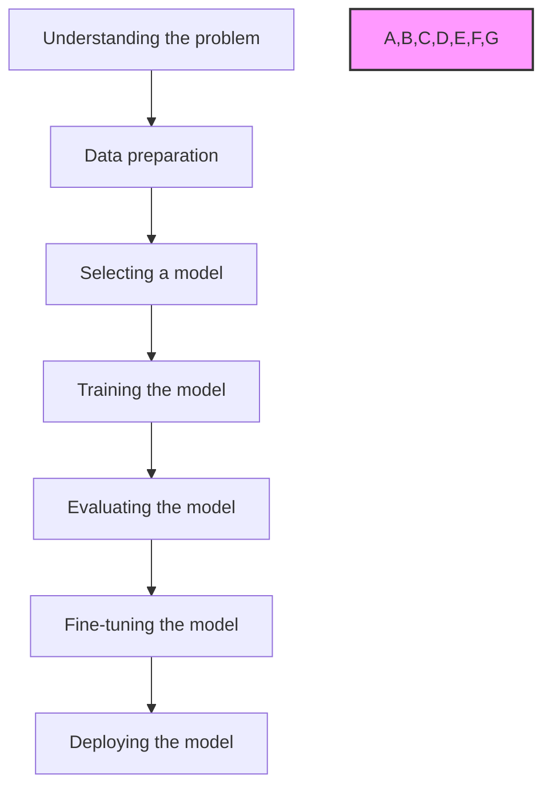

# Data
## Properies(属性)
* Volume：数据规模。
* Variety：不同形式的数据
* Velocity：数据流和生成的速率。
* Value：从中研究人员可以推断出信息的意义。
* Veracity：我们正在处理的数据的确定性和正确性。
* Viability：将数据用于不同系统和流程集成的能力。
* Security：采取措施保护数据免受未经授权访问或操纵。
* Accessiblity: 获得并利用决策目标所需数据时易于使用
* Integrity: 数据在其整个生命周期内准确完整
* Usability: 终端用户使用和解释该项指标时易于操作

## Collection(数据收集)
source: 
* [data.gov.in](https://data.gov.in/)
* [Kaggle](https://www.kaggle.com/)
* [UCI Machine Learning Repository](https://archive.ics.uci.edu/ml/index.php)
* [Google Dataset Search](https://toolbox.google.com/datasetsearch)

## Data Cleaning(数据清洗)
tools:
* Openrefine
* Trifacta Wrangler 
* TIBCO Clarity
* Cloudingo
* IBM Infosphere Quality Stage

# Supervised learning
## 1.Getting started with Classification

### Types of Classification

1.Binary Classification

2.Multiclass Classification

### Types of Classifiers(algorithms)

* Linear Classifiers: Logistic Regression(线性分类器：逻辑回归)
* Tree-Baesd Classifiers: Decision Tree Classifier(基于树的分类器：决策树分类器)
* Support Vector Machines(支持向量机)
* Artificial Neural Networks(人工神经网络)
* Bayesian Regression(贝叶斯回归)
* Gaussian Naive Bayes Classifiers(高斯朴素贝叶斯分类器)
* Stochastic Gradient Descent (SGD) Classifier(随机梯度下降（SGD）分类器)
* Ensemble Methods: Random Forests, AdaBoost, Bagging Classifier, Voting Classifier, ExtraTrees Classifier(集成方法：随机森林、AdaBoost、Bagging 分类器、投票分类器、ExtraTrees 分类器)

## 2.Basic Concept of Ckassification(Data Mining)

### Attributes(属性)

--Represent different features of an object

1.Binary:
* Symmetric(对称): Both values are equally important in all aspect
* Asymmetric(非对称): When both the values may not be important

### Types

#### 1. Discriminative(判别式)
它试图仅依赖于观察到的数据进行建模，严重依赖于数据质量而不是分布。
#### 2. Generative(生成式)
它对各个类别的分布进行建模，并尝试通过估计模型的假设和分布来学习生成数据背后的模型。用于预测未见过的数据。

### Associated Tools and Languages

* 主要使用的语言：R、SAS、Python、SQL
* 主要使用的工具：RapidMiner、Orange、KNIME、Spark、Weka
* 使用的库：Jupyter，NumPy，Matplotlib，Pandas，ScikitLearn，NLTK，TensorFlow，Seaborn, Basemap等。

